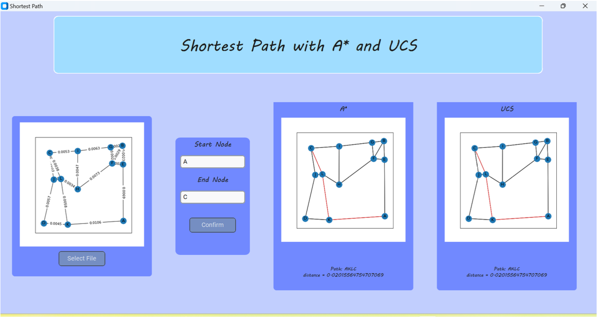

#### `Tucil3_13521111_13521133`

# TUGAS KECIL 3 <br>

#### IF2211 - Strategi Algoritma <br>
### MENENTUKAN LINTASAN TERPENDEK DENGAN ALGORITMA UCS DAN A* <br>

## Daftar Isi

- [Penjelasan Ringkas Program](#penjelasan-ringkas-program)
- [Penjelasan Algoritma](#penjelasan-algoritma)
- [Pre-Requisite](#pre-requisite)
- [Cara Menjalankan Program](#cara-menjalankan-program)
- [Screenshot Hasil Pengujian](#screenshot-hasil-pengujian)
- [Struktur Program](#struktur-program)
- [Kontributor](#kontributor)

## Penjelasan Ringkas Program

Algoritma UCS (Uniform cost search) dan A* (atau A star) dapat digunakan untuk menentukan lintasan terpendek dari suatu titik ke titik lain. Pada tugas kecil 3 ini, kedua algoritma ini digunakan untuk menentukan lintasan terpendek berdasarkan peta Google Map jalan-jalan di kota Bandung dengan ruas-ruas jalan di peta dibentuk menjadi sebuah graf. Simpul menyatakan persilangan jalan (simpang 3, 4 atau 5) atau ujung jalan. Asumsikan jalan dapat dilalui dari dua arah. Bobot graf menyatakan jarak (m atau km) antar simpul. Jarak antara dua simpul dapat dihitung dari koordinat kedua simpul menggunakan rumus jarak Euclidean (berdasarkan koordinat) atau dapat menggunakan ruler di Google Map, atau cara lainnya yang disediakan oleh Google Map.

## Penjelasan Algoritma
### Algoritma UCS
Uniform-Cost Search merupakan algoritma pencarian tanpa informasi (uninformed search) yang menggunakan biaya kumulatif terendah untuk menemukan jalur dari node sumber ke node tujuan.

Cara kerja algoritma uniform-cost search secara singkat sebagai berikut:

1. Masukkan node root ke dalam priority queue
2. Ulangi langkah berikut saat antrian (queue) tidak kosong:
a. Hapus elemen dengan prioritas tertinggi
b. Jika node yang dihapus adalah node tujuan, cetak total biaya (cost) dan hentikan algoritma
c. Jika tidak, enqueue semua child dari node saat ini ke priority queue, dengan biaya
kumulatifnya dari root sebagai prioritas

### Algoritma A*
Algoritma A* (A Star) adalah algoritma pencarian yang digunakan untuk menemukan jalur terpendek antara titik awal dan akhir. Algoritma ini digunakan untuk penjelajahan peta guna menemukan jalur terpendek yang akan diambil.

Cara kerja algoritma A* search secara singkat sebagai berikut:

1. Inisialisasi OPEN LIST
2. Letakkan simpul awal pada OPEN LIST
3. Inisialisasi CLOSE LIST
4. Ikuti langkah-langkah berikut sampai OPEN LIST tidak kosong:
5. Temukan simpul dengan f terkecil pada OPEN LIST dan beri nama "Q".
6. Hapus Q dari OPEN LIST.
7. Generate delapan turunan Q dan tetapkan Q sebagai induknya.
8. Untuk setiap keturunan:
a. Jika menemukan penerus adalah tujuannya, pencarian dihentikan
b. Jika tidak, hitung g dan h untuk penerusnya.
penerus.g = q.g + jarak yang dihitung antara penerus dan q. suksesor.h = jarak terhitung antara suksesor dan tujuan. penerus.f = penerus.g ditambah penerus.h
c. Lewati penerus ini jika node dalam daftar OPEN dengan lokasi yang sama tetapi nilai f lebih rendah dari penggantinya.
d. Lewati penerusnya jika ada simpul dalam CLOSE LIST dengan posisi yang sama dengan penerusnya tetapi nilai f lebih rendah; jika tidak, tambahkan simpul ke ujung OPEN LIST (untuk loop).
9. Push Q ke dalam CLOSE LIST dan akhiri loop sementara.

## Penjelasan Alur Program

1. Tekan button `select file`
2. Pilih file test dengan format .txt yang akan digunakan untuk pencarian lintasan tersingkat
3. Tunggu hingga ditampilkan graph/ peta yang merepresentasikan file
4. Masukkan titik mula dan titik akhir pada kolom yang tersedia
5. Tekan button `confirm`
6. Program akan menampilkan hasil pencarian lintasan tersingkat dengan menggunakan algoritma A* dan UCS pada kolom di kanan kolom masukan dengan keterangan lintasan dan jarak yang ditempuh

## Pre-Requisite
* Python versi 3.9.12, dapat diunduh melalui `https://www.python.org/downloads`
* Library heapq, math, og, tkinter, customtkinter, graph, networkx, matplotlib, dsb. yang diperlukan dapat diunduh dengan menginstall Anaconda melalui `https://www.anaconda.com`

## Cara Menjalankan Program
1. Pastikan device Anda telah memenuhi pre-requisite untuk menjalankan program kemudian clone repository pada local folder Anda.
2. Buka terminal pada directory clone repository.
3. Jalankan `python ./src/gui.py` pada terminal
4. Program akan berjalan dan Anda dapat menjalankan permainan dengan mengikuti penjelasan alur program di atas.

## Screenshot Hasil Pengujian



## Struktur Program

```bash
├── README.md
├── doc
│   └── Tucil3_13521111_13521133.pdf
├── src
│   ├── __pycache__
│   │   ├── astar.cpython-38.pyc
│   │   ├── astar.cpython-39.pyc
│   │   ├── graph.cpython-38.pyc
│   │   ├── graph.cpython-39.pyc
│   │   ├── main.cpython-38.pyc
│   │   ├── readfile.cpython-38.pyc
│   │   ├── readfile.cpython-39.pyc
│   │   ├── ucs.cpython-38.pyc
│   │   ├── ucs.cpython-39.pyc
│   │   ├── visualize.cpython-38.pyc
│   │   └── visualize.cpython-39.pyc
│   ├── astar.py
│   ├── gmaps.py
│   ├── graph.py
│   ├── gui.py
│   ├── readfile.py
│   ├── ucs.py
│   └── visualize.py
└── test
    ├── test copy.txt
    ├── test-1.txt
    ├── test-2.txt
    ├── test-3.txt
    ├── test-4.txt
    └── test.txt
```

## Kontributor

13521111 Tabitha Permalla
13521133 Cetta Reswara Parahita